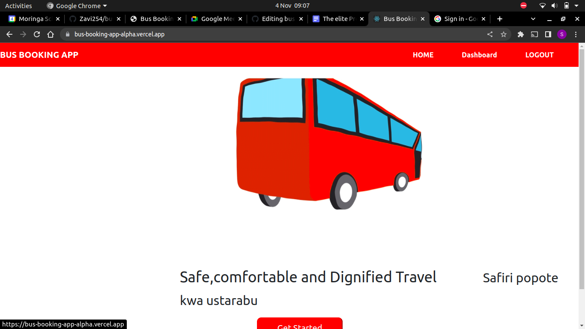
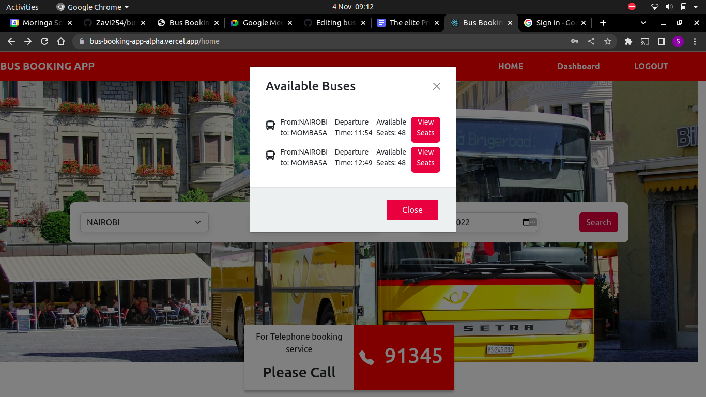
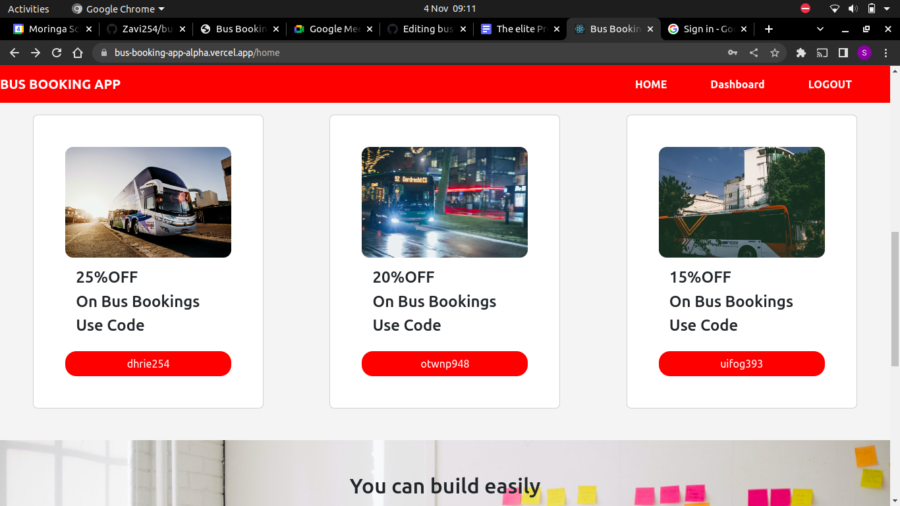
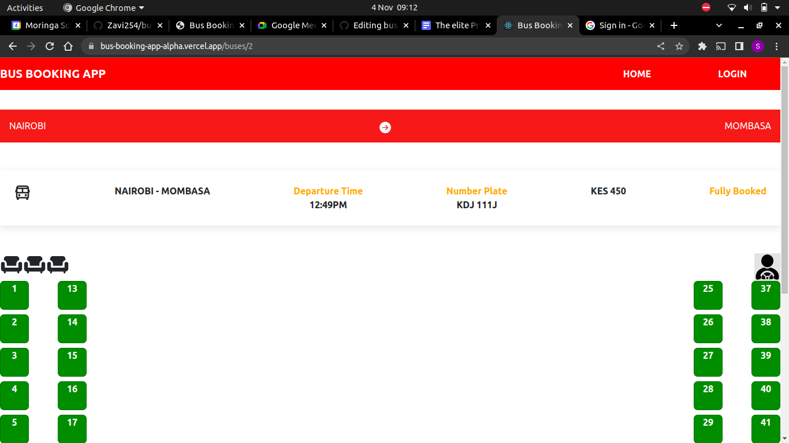
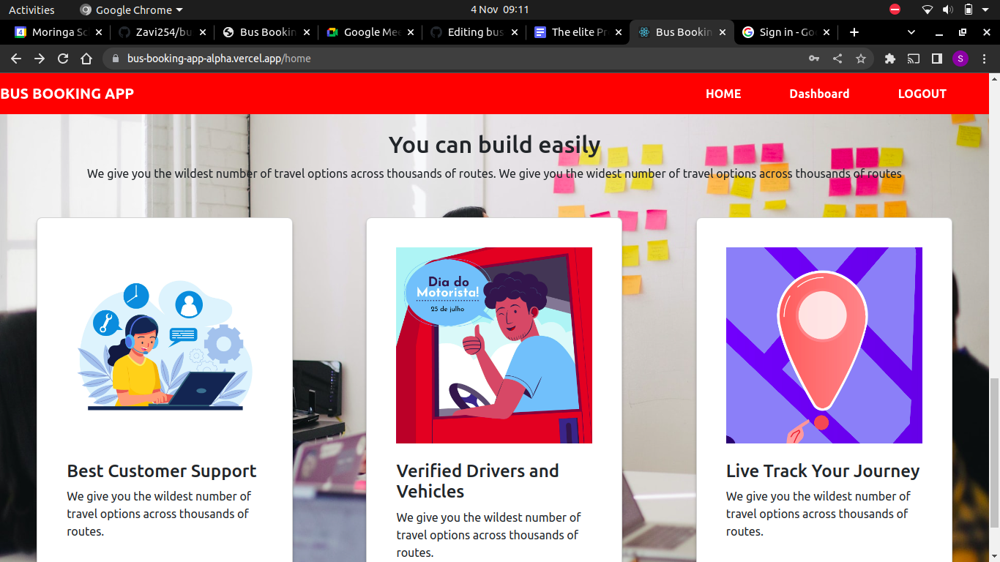
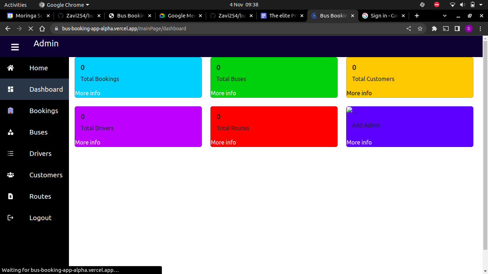

# Table of Contents
1. Project Name
2. Author
3. Description
4. Screenshots
5. Features
6. Technologies Used
7. Installation and setup instructions

# Project Name

 ## BUS BOOKING WEB APP
# Authors
 Steven Otieno, Brian Ndinda, Byrone Odhiambo, Bernard Ngari and Bernard Okoth

## Description
 Bus Booking App is a web based application that has three main users: Admin, Driver and Customer. It enables the Customer to search or available buses for booking on a specific date, while the driver is the one who is responsible for adding the bus and the number of seats and the admin is the super user who is able to keep track of all the activities that have been happening in the whole application.

# Screenshots

### Landing Page

### HomePage

### List of Buses

### Offers Section

### Booking

### About Us

### Admin Dashboard

### Driver Dashboard

# Features

 - Allow drivers to register new buses(no. Of seats, cost per seat, route, time of travel) to the system.
 - Allow drivers to schedule their buses for travel,together with their routes.
 - Allow drivers to add prices per seat.
 - Give drivers the right to add, update, or remove buses based on their availability.
 - Allow customers to schedule their travel by booking seats based on the availability of buses.
 - Allow customers to delete, update their bookings.
 - Allow customers to view available seats before booking.

# Technologies Used
- HTML
- CSS
- Javascript(REACT)
- Bootstrap 5
- Ruby on Rails

# Installation and Setup Instructions
### Requirements
- A web browser.
- A Text Editor(Visual Studio Code).
- An Internet Connection.

### Setup Instructions
- Clone the repository.

 - ` git clone git@github.com:Zavi254/bus-booking-app.git`.
- Open the folder in your local machine in visual studio code
- To start the application , move to the visual studio code terminal and the run `npm start`

# License

Copyright (c) 2022 Steven Otieno

Permission is hereby granted, free of charge, to any person obtaining a copy of this software and associated documentation files (the "Software"), to deal in the Software without restriction, including without limitation the rights to use, copy, modify, merge, publish, distribute, sublicense, and/or sell copies of the Software, and to permit persons to whom the Software is furnished to do so, subject to the following conditions:

The above copyright notice and this permission notice shall be included in all copies or substantial portions of the Software.

THE SOFTWARE IS PROVIDED "AS IS", WITHOUT WARRANTY OF ANY KIND, EXPRESS OR IMPLIED, INCLUDING BUT NOT LIMITED TO THE WARRANTIES OF MERCHANTABILITY, FITNESS FOR A PARTICULAR PURPOSE AND NONINFRINGEMENT. IN NO EVENT SHALL THE AUTHORS OR COPYRIGHT HOLDERS BE LIABLE FOR ANY CLAIM, DAMAGES OR OTHER LIABILITY, WHETHER IN AN ACTION OF CONTRACT, TORT OR OTHERWISE, ARISING FROM, OUT OF OR IN CONNECTION WITH THE SOFTWARE OR THE USE OR OTHER DEALINGS IN THE SOFTWARE.